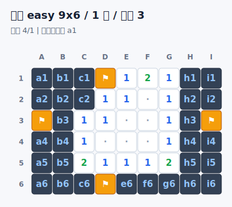
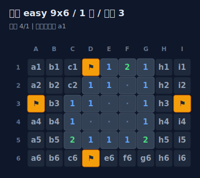
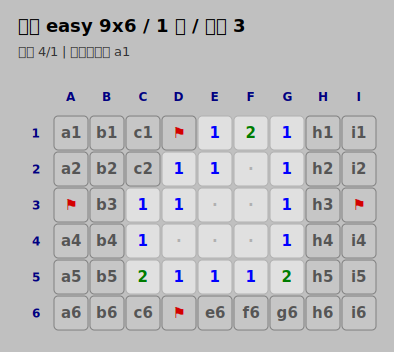

# ShinBot 扫雷插件

会话级（session-scoped）的聊天扫雷游戏插件。每个 ShinBot 会话独立保存一局游戏，
支持斜杠命令和逗号快捷指令两种操作方式，可输出纯文本棋盘，也可在安装了 RenderKit
的情况下渲染为 PNG 图片。

- 插件 ID：`shinbot_plugin_minesweeper`
- 命令：`/minesweeper`，别名 `/ms`
- 权限：`cmd.minesweeper`
- 角色：`logic`

## 快速上手

```text
/ms start easy      # 开始一局简单难度
/ms theme dark      # 切换当前会话的图片棋盘主题
/ms open a1         # 打开 A1
,op a1 b1           # 逗号快捷指令，一次打开多格
,flg c3             # 给 C3 插旗 / 取消插旗
,ch d4             # 对已打开的数字格 D4 连开
/ms status          # 查看当前棋盘
/ms restart         # 用相同设置重开
/ms quit            # 结束本局
```

直接发送 `/ms`（不带参数）会返回帮助信息。

## 命令一览

### 根命令 `/minesweeper`（别名 `/ms`）

| 命令 | 作用 | 别名 |
| --- | --- | --- |
| `/ms` | 显示帮助 | `help`、`h` |
| `/ms start <难度或尺寸>` | 开始新游戏 | `new` |
| `/ms restart [难度或尺寸]` | 重开；省略参数时沿用当前局设置 | `r` |
| `/ms open <坐标...>` | 打开一个或多个格子 | `o` |
| `/ms flag <坐标...>` | 插旗 / 取消插旗 | `f` |
| `/ms chord <坐标...>` | 连开（对已揭开的数字格） | `c` |
| `/ms status` | 查看当前棋盘，不计入"最近棋盘"消息追踪 | `board`、`b` |
| `/ms theme [主题]` | 查看或切换当前会话的图片棋盘主题 | `themes`、`t`、`主题` |
| `/ms quit` | 结束本局 | `stop` |

坐标大小写不敏感，`a1` 与 `A1` 等价。列用字母、行用数字，例如 `A1`、`C7`，
超过 26 列时使用 `AA`、`AB` 这样的多字母列名。`open` / `flag` / `chord` 支持在一条
命令里写多个坐标，重复坐标会报错。

### 逗号快捷指令

快捷指令以英文逗号 `,` 开头，只支持三个动词，且要求当前会话有进行中的游戏：

| 快捷指令 | 等价命令 | 说明 |
| --- | --- | --- |
| `,op a1 b1 ...` | `/ms open` | 打开一个或多个格子 |
| `,flg c3 d4 ...` | `/ms flag` | 插旗 / 取消插旗 |
| `,ch e5 ...` | `/ms chord` | 连开数字格 |

逗号与动词之间可有空格（如 `, op a1`），动词大小写不敏感。
快捷指令前缀可通过配置项 `shortcut_prefix` 调整，例如设为 `"."` 后使用 `.op a1`、
`.flg b2`、`.ch c3`。配置在插件加载时读取；是否能不重启生效取决于 ShinBot 的插件配置
重载机制。

## 难度与棋盘尺寸

### 预设难度

| 难度 | 尺寸 | 雷数 |
| --- | --- | --- |
| `easy` | 9 × 9 | 10 |
| `normal` | 16 × 16 | 40 |
| `hard` | 30 × 16 | 99 |

```text
/ms start easy
/ms start normal
/ms start hard
```

### 自定义棋盘

以下三种写法等价（宽 12、高 12、雷 20）：

```text
/ms start 12 12 20
/ms start 12x12 20
/ms start custom 12 12 20
```

自定义尺寸受插件配置约束（默认范围）：

- 宽度：5 – 30
- 高度：5 – 24
- 雷数：1 – 200

此外有两条硬性规则：

- 雷数必须**小于格子总数**。
- 对于大于 3 × 3 的棋盘，雷数不能超过 `宽 × 高 − 9`，以保证首开安全区。

若配置中 `allow_custom = false`，则禁止自定义棋盘。

## 游戏规则

- **首开安全**：地雷在第一次打开时才惰性生成，首个打开的格子保证安全。生成器会优先
  把首格及其周围 8 格都排除在外；当棋盘太密无法满足时，退化为仅排除首格。
- **连开（chord）**：对一个已揭开的数字格执行连开时，若其周围旗子数等于该数字，会
  自动打开周围未插旗的格子。只能对已揭开的数字格使用。
- **胜利**：揭开所有非雷格即获胜。
- **失败**：打开任意含雷格即踩雷，本局结束。

## 棋盘渲染

每条棋盘回复包含：难度、尺寸、雷数、步数、已插旗数、状态行、最近一次操作，以及棋盘网格。

默认 `render_mode = "auto"`：装有 RenderKit 且其 SVG 后端可用时输出图片棋盘，否则
自动回退到纯文本棋盘。若想强制纯文本，把 `render_mode` 设为 `"text"`。

### 文本模式

`render_mode = "text"`（或图片渲染不可用时的回退）输出紧凑的纯文本棋盘，兼容所有不
支持图片上传的适配器。

符号含义：

| 含义 | Unicode（默认） | ASCII（`ascii_symbols = true`） |
| --- | --- | --- |
| 未揭开 | `■` | `#` |
| 插旗 | `⚑` | `F` |
| 空白（周围 0 雷） | `·` | `.` |
| 地雷 | `*` | `*` |
| 踩中的雷 | `!` | `X` |
| 数字 | `1`–`8` | `1`–`8` |

### 图片模式（默认）

`render_mode` 为 `"auto"`（默认）或 `"image"` 时，插件会尝试调用可选的 **RenderKit**
插件，把内部生成的 SVG 棋盘栅格化为 PNG 图片，并以 `img` 消息元素发送。这是
**尽力而为**的路径：当 RenderKit 未安装、其 SVG 后端不可用，或渲染失败时，会自动
回退到纯文本棋盘。注意 RenderKit 是可选依赖，并未列入本插件的强制依赖，需要单独安装。

SVG 的生成逻辑保留在扫雷插件内部（因为它掌握游戏特定的棋盘语义），RenderKit 仅负责
通用的图片栅格化。`image_scale` 可放大输出图片（范围 0 – 4）。

### 主题

图片棋盘支持多套配色主题。配置项 `theme` 设置默认主题，当前会话也可用
`/ms theme light|dark|classic` 临时切换；不带参数的 `/ms theme` 会显示当前主题。
内置三套：

| 主题 | 风格 |
| --- | --- |
| `light` | 浅色（默认），米白背景、深石板灰未揭格、经典数字分色 |
| `dark` | 深色，深蓝灰背景、提亮的数字配色，适合暗色聊天界面 |
| `classic` | 复古，仿传统扫雷的灰色棋盘与经典数字色 |

主题只影响图片渲染，纯文本棋盘不受影响。会话主题会随当前游戏状态持久化；
`/ms restart` 沿用当前会话主题。图片棋盘的未揭格子会显示坐标标签（如 `a1`、`b3`），
方便识别要操作的格子。以下是三套主题的渲染效果：

| `light`（默认） | `dark` | `classic` |
| --- | --- | --- |
|  |  |  |

## 配置项

在 ShinBot 配置文件中，于本插件配置块下设置以下字段：

| 字段 | 类型 | 默认值 | 说明 |
| --- | --- | --- | --- |
| `default_difficulty` | `easy` \| `normal` \| `hard` | `easy` | 无参数 `start` 使用的难度 |
| `default_custom_width` | int (5–60) | `12` | 自定义时省略宽度的默认值 |
| `default_custom_height` | int (5–40) | `12` | 自定义时省略高度的默认值 |
| `default_custom_mines` | int (1–999) | `20` | 自定义时省略雷数的默认值 |
| `max_width` | int (5–60) | `30` | 自定义宽度上限 |
| `max_height` | int (5–40) | `24` | 自定义高度上限 |
| `max_mines` | int (1–999) | `200` | 自定义雷数上限 |
| `allow_custom` | bool | `true` | 是否允许自定义棋盘 |
| `persist_games` | bool | `true` | `true` 写入 JSON 文件持久化；`false` 仅内存保存 |
| `reveal_mines_on_loss` | bool | `true` | 失败时是否揭示所有地雷 |
| `show_coordinates` | bool | `true` | 棋盘是否显示行列坐标 |
| `ascii_symbols` | bool | `false` | 使用 ASCII 符号替代 Unicode |
| `render_mode` | `text` \| `auto` \| `image` | `auto` | 渲染模式 |
| `theme` | `light` \| `dark` \| `classic` | `light` | 图片棋盘配色主题 |
| `shortcut_prefix` | string | `,` | 快捷指令前缀，例如 `.` 会启用 `.op/.flg/.ch` |
| `image_scale` | float (0–4] | `1.0` | 图片模式缩放倍数 |
| `recall_old_boards` | bool | `true` | 是否撤回（删除）旧棋盘消息 |
| `keep_recent_board_messages` | int (1–5) | `2` | 保留多少条最近棋盘消息不撤回 |
| `session_idle_ttl_seconds` | int (60–604800) | `86400` | 会话闲置多久后清理（秒） |

## 持久化与消息管理

- **持久化**：游戏以 ShinBot 会话 ID 为键。默认存储（`persist_games = true`）将每局
  以 JSON 文件写入插件数据目录下的 `games/`；设为 `false` 时改为纯内存存储，进程退出
  即丢失。每次构建存储时会按 `session_idle_ttl_seconds` 清理过期会话。
- **旧棋盘撤回**：当适配器支持消息删除时，插件会尽力撤回较旧的棋盘消息，只保留最近
  `keep_recent_board_messages` 条，让聊天保持整洁。`/ms status` 输出的棋盘不计入该追踪。

## 错误处理

非法操作会返回中文提示，例如：

- 不能标记已经打开的格子。
- 不能打开已标记的格子。
- 只能对已打开的数字格连开。
- 坐标无效 / 坐标超出棋盘 / 重复坐标。
- 雷数超出范围 / 雷数必须小于格子总数 / 雷数太多，无法保证首开安全。

更多设计细节见 [DESIGN.md](./DESIGN.md)。
